# 相机噪声标定流程

## 第一部分：EMVA1288 相机的线性模型及噪声

### 像素曝光与相机的线性信号模型

首先，我们需要了解噪声生成的整个过程，并尝试建立一个物理噪声模型，以便进行噪声标定。下图（来自EMVA1288）给我们展示了一个相机的通用物理模型。

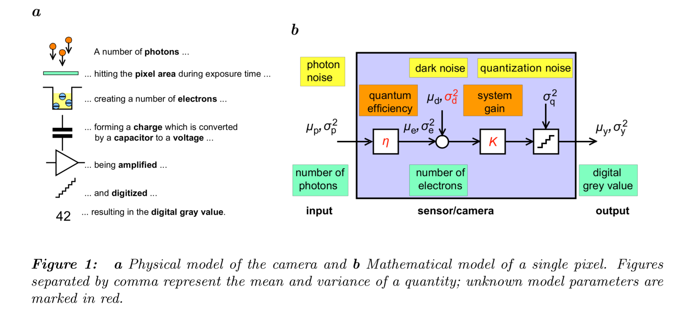

所谓的EMVA1288标准，是欧洲机器视觉委员会专门编写的关于数字图像传感器以及相机特性的量化评估标准。该标准历史悠久，我们现在采用的是最新的4.0版本，4.0版本分为了线性版和非线性版，其中线性版本就是针对我们日常使用的数码相机、手机、单反这样常规的相机数字图像传感器，而非线性版本则是指那些不符合线性曝光过程的相机。所以本文所指的EMVA1288主要是针对线性版来展开讲解。

从EMVA1288中我们知道，在整个相机电子系统中，由光照累积的电荷单位被转换为电压，经过放大，最终通过模数转换器（ADC）转换为数字信号$y$。而这整个过程可以看作是线性的，并且可以用具体的量来描述，如系统增益$K$（单位为$DN/e^{-}$，这里$DN$为Digital Number的缩写）等等。所以关于上图中的数字量$\mu_y$（平均像素值）可以建立如下公式：
$$
\mu_y = K(\mu_e + \mu_d) \quad or \quad \mu_y = \mu_{y \cdot dark} + K\mu_e  \qquad (1)
$$
而平均光子数$\mu_p=\frac{AEt_{exp}}{h\nu}=\frac{AEt_{exp}}{hc/\lambda}$，其中$A$为传感器面积，$E$是传感器表面在曝光时间$t_{exp}$ 内的光照度，单位为$W/m^2$，而平均电子数$\mu_e=\eta \mu_p$​，因此上述方程(1)可以转换为以下方程：
$$
\mu_y = \mu_{y\cdot dark} + K\eta \mu_p = \mu_{y\cdot dark} + K\eta\frac{\lambda A}{hc}Et_{exp}  \qquad (2)
$$

### 噪声模型

散粒噪声（Shot noise）是**泊松分布**的，因此有$\sigma_{e}^2=\mu_e$；根据上图噪声生成模型所示，所有与传感器读出和放大电路相关的噪声源都可以用一个方差为 $\sigma_d^2$ 的与信号无关的**正态分布**噪声源来描述。最终的模数转换会在量化区间之间添加另一个**均匀分布**的噪声源，其方差为 $\sigma_q^2=1/12DN^2$。由于所有噪声源的方差线性相加，根据误差的传播规则，数字信号$y$ 的总时域方差(temporal variance)$\sigma_y^2$ 可以表示为：
$$
\sigma_y^2 = K^2(\sigma_d^2 + \sigma_e^2) + \sigma_q^2 \qquad (3)
$$
噪声可以与测量的平均数字信号相关联（利用公式(1)以及$\sigma_{e}^2=\mu_e$​）：
$$
\begin{matrix} \sigma_y^2 = \underbrace{K^2\sigma_d^2 + \sigma_q^2} \qquad \\offset    \end{matrix}
\begin{matrix}+\underbrace{K}(\mu_y-\mu_{y\cdot dark})\\slope \qquad \quad \qquad\end{matrix}  \qquad(4)
$$
**这个方程是传感器特性表征的核心，根据噪声方差$\sigma_y^2$ 与光诱导数字信号均值$\mu_y - \mu_{y\cdot dark}$ 之间的线性关系，可以由斜率确定整体系统增益$K$，并从偏移量确定暗噪声方差$\sigma_d^2$ ，这种方法被称为光子转移方法（Photon Transfer Method）。**


### 数字信号均值和方差的计算

通过光子转移曲线（公式(4)）我们知道，要想求出整体系统增益（也就是斜率），我们需要得到一组关于数字信号的方差$\sigma_y ^2$以及均值$\mu_y-\mu_{y\cdot dark}$，以下讲解如何求出这些量：

一、像素的均值

首先我们需要计算像素的均值，在实际操作时我们可以这样：在每一个特定的曝光时间下，用相同的相机设置拍摄正对着相机的一个均匀图卡两次，如下图所示，而总共需要在多种曝光时间下进行：

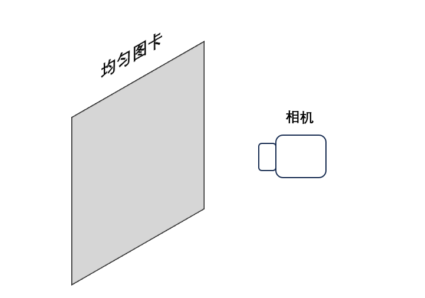

接下来，我们就可以求特定曝光时间下，这两幅图像中图卡所在区域的像素均值，首先在每幅图像上求均值，再把两次的均值做平均——注意这里的结果也包含了暗信号导致的像素值。如果我们调整相机拍摄的距离，可以使得整个图卡充满相机的视场，这样如果一幅图像的长宽为$M\times N$ ，我们就可以充分利用到所有的像素来计算图像均值了。
$$
在某个曝光时间t_{exp}下求均匀图卡的像素均值
\\
\mu_y[k]=\frac{1}{NM}\sum_{m=0}^{M-1}\sum_{n=0}^{N-1}y[k][m][n],(k=0,1) \quad and \quad \mu_y = \frac{1}{2}(\mu_y[0]+\mu_y[1]) \qquad(5)
$$
注意这里是在一个特定曝光时间下进行的，我们可以在多个曝光时间下重复上述步骤，这样可以得到多个图像（有些文献称为flat-field frame）均值。

现在我们遮住相机的镜头，此时没有光线进入相机。我们重复上述步骤就可以测出在多个曝光时间下的暗信号（有些文献也称为bias frame）的均值：
$$
\mu_{y\cdot dark}[k]=\frac{1}{NM}\sum_{m=0}^{M-1}\sum_{n=0}^{N-1}y_{dark}[k][m][n],(k=0,1) \quad and \quad \mu_{y\cdot dark} = \frac{1}{2}(\mu_{y\cdot dark}[0]+\mu_{y\cdot dark}[1]) \quad(5d)
$$
通过上面两步，我们得到了公式(4)中的$\mu_y$ 和$\mu_{y\cdot dark}$ 


二、信号时域噪声的方差

当我们要求一个随机变量的均值和方差时，通常需要在时域上得到很多个这个变量的值才行。我们在前面之所以在空域上求像素的均值，是基于这样的假设：图像传感器上的每个像素之间的分布是相同的，所以我们用空域上的多个像素值代替了时域上变化的像素值（时域上我们对同一个曝光时间只拍了两幅图像，理论上同一个像素只有两个样本）。为了求得像素值在时域上的变化方差，我们可以基于同样的思想来做。那么似乎按照下面的公式来求就可以完成：
$$
\sigma_y^2=|y-\mu_y|^2 \approx \frac{1}{NM} \sum_{m=0}^{M-1}\sum_{n=0}^{N-1}(y[m][n]-\mu_y)^2
$$
不过，除了现在描述的这种像素之间的一致性的随机分布，一般在传感器上还会有一种固定的空间噪声，它体现了传感器像素阵列的空间非均匀性。比如在https://homes.psd.uchicago.edu/~ejmartin/pix/20d/tests/noise/index.html#patternnoise中展示的Canon 20D的传感器的空间非均匀性，我们肉眼很容易看出这里的横向条纹，这就是这种非均匀性。所以我们在计算像素值的时域方差时，要特别小心这一点，在这种情况下，整个图像的方差由两部分构成，一个是像素值自身的波动，一个是像素阵列的空间非均匀性。
$$
\frac{1}{NM}\sum_{m=0}^{M-1}\sum_{n=0}^{N-1}(y[k][m][n]-\mu[0])^2=\sigma_y^2 + s_y^2 \qquad(6)
$$
由于空间非均匀性对一个传感器是固定的，所以当我们拍摄两幅图像后，就可以消去这个变量。我们用这两幅图像的方差的差，来估计单个像素时域方差，所以我们可以得到下面的公式：
$$
在某个曝光时间t_{exp}下求均匀图卡的像素方差
\\
\sigma_y^2 = \frac{1}{2NM}\sum_{m=0}^{M-1}\sum_{n=0}^{N-1}[(y[0][m][n]-\mu[0])-(y[1][m][n]-\mu[1])]^2 \\
= \frac{1}{2NM}\sum_{m=0}^{M-1}\sum_{n=0}^{N-1}(y[0][m][n]-y[1][m][n])^2 - \frac{1}{2}(\mu[0]-\mu[1])^2 \qquad (7)
$$
当我们多次改变曝光时间时，我们将得到多个$\sigma_y^2$ 和$\mu_y - \mu_{y\cdot dark}$ ，因而由公式（4）就容易得到此时的系统增益$K$，以及总的加性噪声了$K^2\sigma_d^2 + \sigma_q^2$ 。


### 信噪比

关于信噪比的计算公式有很多，而在EMVA1288中信噪比的计算公式如下：
$$
SNR=\frac{E(I)}{\sigma(I)} = \frac{\mu_y-\mu_{y\cdot dark}}{\sigma_y} \qquad (8)
$$
由于我们已经得到一组像素均值和方差，后续将利用这一公式求出SNR的变化曲线图。

利用公式（2）和（4），上述公式变形为：
$$
SNR(\mu_p)=\frac{K\eta \mu_p}{\sqrt{K^2\sigma_d^2+\sigma_q^2+K^2\eta\mu_p}}=\frac{\eta \mu_p}{\sqrt{\sigma_d^2+\sigma_q^2/K^2+\eta\mu_p}}
$$
可以看出，信噪比是以平均光子数为自变量的，同时这里的量化噪声一般来说相对较小，这意味着在计算信噪比的过程中，系统增益$K$​几乎可以忽略不记。那么信噪比可以说只取决于传感器的光量子效率(QE，注意它与波长相关)，以及暗噪声。


> 关于空域非一致性，个人认为现今的摄像机传感器制造工艺不断在进步，针对拍摄的暗场图像没有很明显的行间非一致性，列间非一致性或者像素间非一致性，所以这里没有列出其测量方法。具体方法可以参考EMVA1288空域非一致性部分。


## 第二部分：测量与评估

我们可以通过光子转移方法得到相机系统增益$K$，在此之前我们需要拍摄一组明场图像(flat-field frame)和暗场图像(bias frame)，以下是我的拍摄参数：

|     Setup     | ISO  |  f/#  |  f   |   Temperature    |
| :-----------: | :--: | :---: | :--: | :--------------: |
| Canon EOS M50 | 3200 | f/5.6 | 15mm | room temperature |

设定的不同曝光时间为： 1/4000s, 1/3200s, 1/2500s, 1/2000s, 1/1600s, 1/1250s, 1/1000s, 1/800s, 1/640s, 1/500s, 1/400s, 1/320s, 1/250s, 1/200s, 1/160s, 1/125s, 1/100s, 1/80s, 1/60s, 1/50s, 1/40s, 1/30s, 1/25s, 1/20s, 1/15s, 1/13s, 1/10s, 1/8s, 1/6s, 1/5s, 1/4s, 1/3s, 0.4s, 0.5s, 0.6s, 0.8s

总结来说，明场图像有36组（每组为在不同曝光时间，其他设置相同下连续拍摄的两张图片），暗场图像也36组（每组为在不同曝光时间，其他设置相同下连续拍摄的两张图片），所有数据都可以在目录'./images/'中找到。

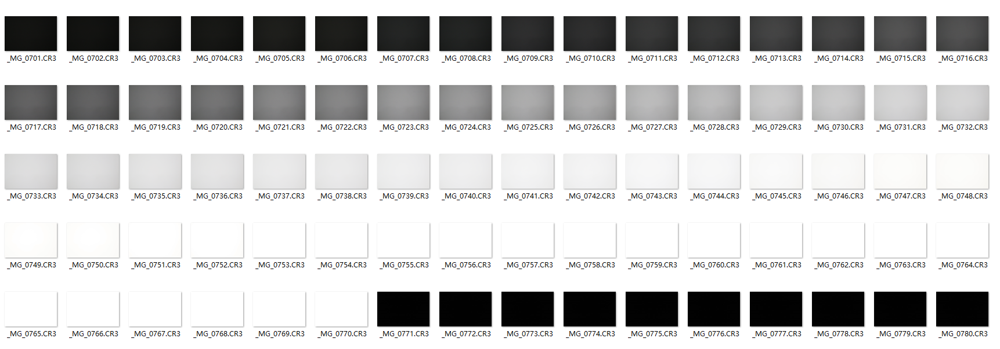

### 系统增益的测量

> 关键点：$\sigma_y^2=offset+K(\mu_y-\mu_{y\cdot dark})$ 

通过光子转移方法测出的结果如下：

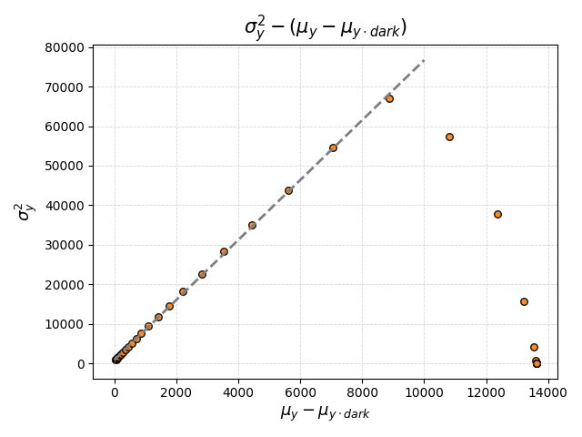

该图展示了测量的方差 $\sigma_y^2$ 与平均像素值 $\mu_y - \mu_{y\cdot dark}$ 的关系，以及用于确定系统增益 $K$ 的线性回归曲线。绿色点标记了用于线性回归的0-70%的饱和范围。系统增益 $K$ 的值是通过one-sigma原则的统计不确定性（以百分比表示）得到的。

计算代码包含在 python 文件 “noise_calibration.py” 中，对应生成上述图表的代码片段如下所示：

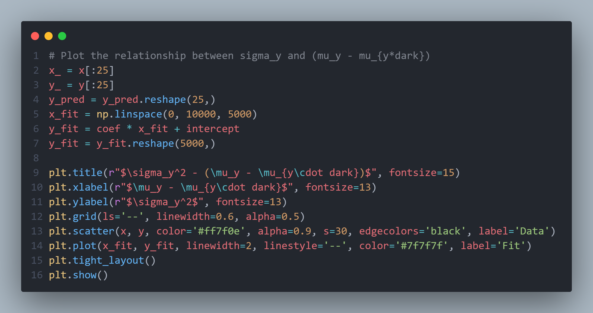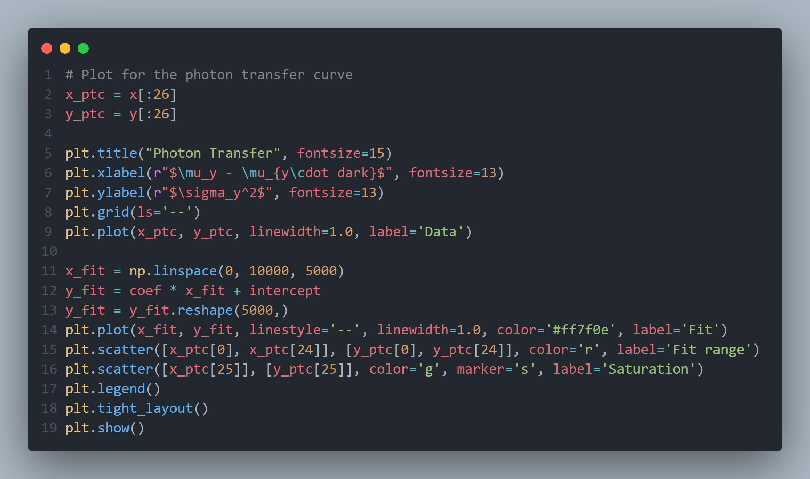

拟合结果：

斜率：$K = 7.58621139$  截距：840.16712447

线性范围：0~69.44%（0-70%）符合EMVA1288关于 0-70%饱和范围的标准


### 信噪比的测量

> 关键：$SNR=\frac{\mu_y-\mu_{y\cdot dark}}{\sigma_y}$ 

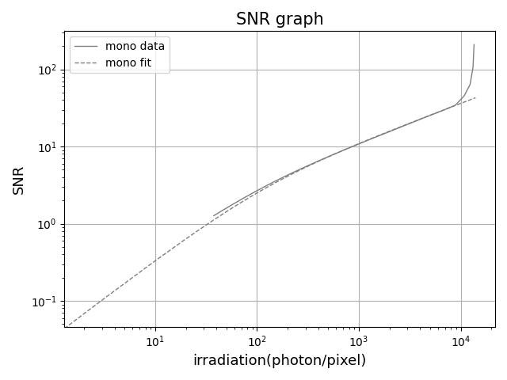

计算代码包含在 python 文件 “noise_calibration.py” 中，对应的代码片段如下所示：

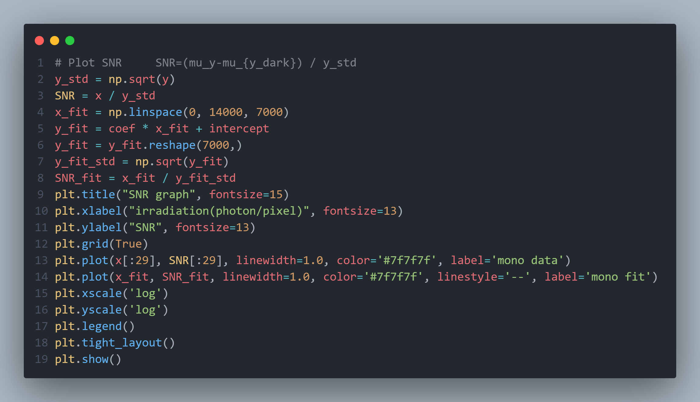


### 在特定温度下暗电流的评估

代码实现原理在"Expo.py" 和 "ISO.py"这两个文件中，实现的结果如下：

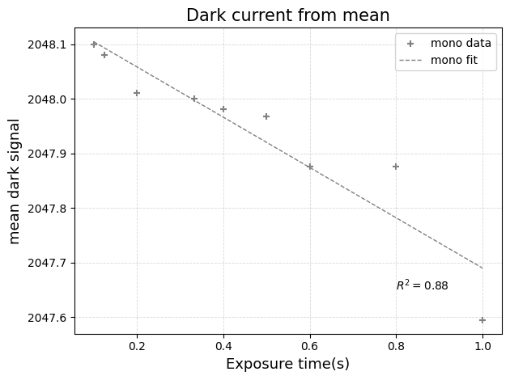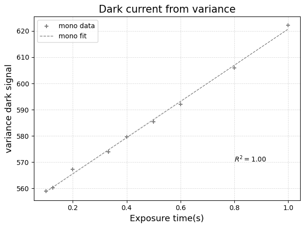

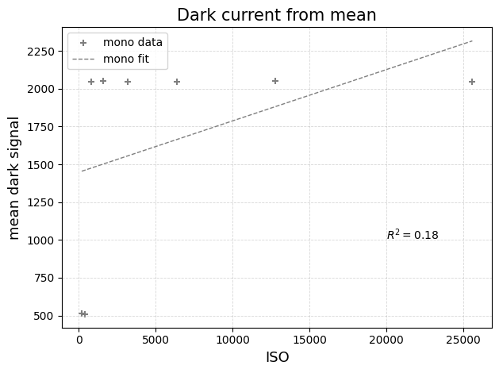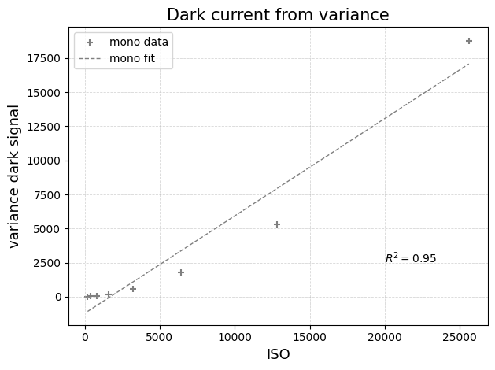


## 第三部分：ELD噪声模型

原论文：[Physics-Based Noise Modeling for Extreme Low-Light Photography](https://ieeexplore.ieee.org/abstract/document/9511233)


该论文提出了一个与EMVA1288稍微有点区别的物理噪声模型，具体分析来说：

1）**将读出噪声分为了暗电流噪声$N_d$ 、源随器噪声$N_s$ 以及热噪声$N_t$ ；**

而EMVA1288在读出噪声上仅考虑的是暗信号的噪声：其中暗信号对应的是暗电荷，它并不是一个固定的值，而是一个与曝光时间和温度都相关的电荷值。具体来说它由两部分组成，其单位是电荷/像素，即每像素平均的暗电荷值。
$$
暗电荷由两部分组成
\\
\mu_d=\mu_{d\cdot 0} +\mu_{therm}=\mu_{d\cdot 0} + \mu_{I\cdot y}t_{exp} \qquad (9)
$$
这里第一部分是一个与曝光时间无关的部分，主要是各种电子电路引起的噪声，而$\mu_{d\cdot0}$是它的平均值。

而第二部分是一个与曝光时间直接相关的量，同时也是与温度相关，这一部分可以被称为热电荷，其中$\mu_{I\cdot y}$是所谓的热电流，它的单位是$e^-/(pixel \cdot s)$ ，即电荷/像素秒。

2）**空域非一致性主要考虑的是行间非一致性；**

3）**将读出噪声和行噪声放到系统增益之后；**关于这一点我有点疑惑，因为读出噪声和行噪声是在电子转换为电压这一阶段的，这在原论文也有提到，但是在公式中却没有体现出读出噪声和行噪声被系统增益$K$ 放大的影响。其实更准确地来说，根据[High-level numerical simulations of noise in CCD and CMOS photosensors: review and tutorial](https://arxiv.org/abs/1412.4031)论文中的说法，$N_d$和$N_t$ 是在增益放大前（这两噪声是在Electrons阶段），而$N_s$ 是在增益放大后（在Voltage阶段），所以应该分开来讨论。不过原论文作者可能为了简化分析，就可能没分开来讨论各自的影响了。

总而言之，ELD的总体噪声模型可以用以下公式来表示：
$$
N=KN_p+N_{read}+N_r+N_q \qquad(10)
$$


### a)光子散粒噪声$N_p$​

光子散粒噪声$N_p$服从的分布：$(I+N_p) \sim \mathcal{P}(I)$ 

1. 当得出$K$之后，就可以将原始数字信号$D$转换为光电子数$I$ :  可通过$\mu_y - \mu_{y\cdot dark} = K \mu_e$计算出$\mu_e$；

   这里将原论文中的公式和EMVA1288作对比以直观地展示各变量的含义：

   ELD：$Var(D) = K^2I+Var(N_o)=K(KI)+Var(N_o)$

   EMVA1288：$\sigma_y^2 = K^2\sigma_d^2+\sigma_q^2 + K(\mu_y - \mu_{y\cdot dark})$​

   所以这里可以很清楚地看出$KI=\mu_y-\mu_{y\cdot dark}$

2. 然后对其施加泊松分布：因为光电子数服从泊松分布，其各个曝光时间的均值已知，所以可以计算出其PMF；

   具体来说，因为在每一特定曝光时间下的均值$I=\frac{\mu_y-\mu_{y\cdot dark}}{K}$ 可以确定，也就是泊松分布的$\lambda$ 也已确定，所以可以轻易计算出PMF，下图为四个特定曝光时间下的例子：

   

3. 最后将其还原回$D$，进而模拟了真实的光子散粒噪声：其实就是直接利用了$K \mu_e = \mu_y - \mu_{y\cdot dark}$ ，这样就表示了在未加噪声前的数字信号$D'=K\mu_e$ 而$D = D' + N$，这里的$N = KN_p+N_{read} + N_r + N_q$


**具体实现代码：**

在文件noise_calibration.py中，实现代码片段如下：

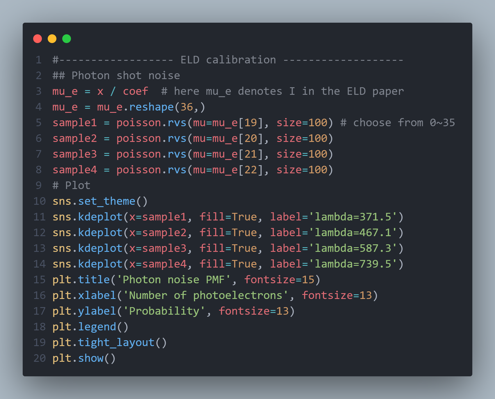

### b)颜色偏差$\mu_c$

由于相机成像过程（或者说CMOS传感器中黑电平的存在），全黑状态下拍摄的暗场图中像素值的平均值并不为零，而是应该处于传感器黑电平的位置，而ELD论文提出传感器中直流电噪声会导致一部分的颜色偏差，也就是说直流电噪声会使得像素值均值在黑电平上下波动，因此做了如下测量和评估：

对于给定一张暗场图像，可以求各个颜色通道的平均值来算出每个通道与其黑电平的偏差。下图所示为在36张暗场图像中统计出的颜色偏差（所用设备为佳能M50）：

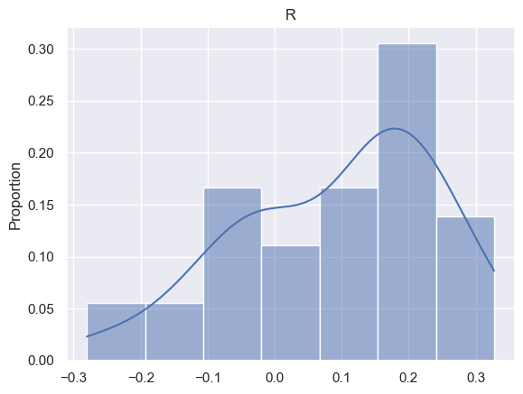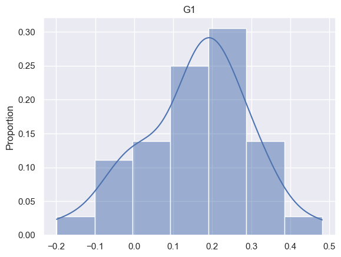

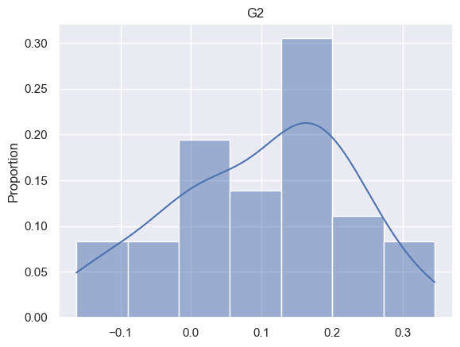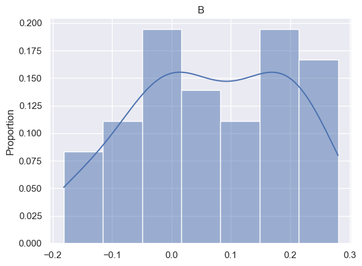

与原论文进行对比：


可以发现佳能M50的偏差不大，所以应该可以推测出随着现如今制造工艺的进步，这方面的误差应该也会越来越小了。

> 关于如何得到黑电平：可以通过dcraw来获取
>
> dcraw是一个非常有名的软件，专门用于解析RAW格式的图像，在它的官网上列出了大量利用了dcraw进行核心解析代码的软件，可以点击去查看下。在Ubuntu上，只需要在终端输入sudo apt-get install dcraw就可以安装该软件了。（不过需要注意的是dcraw不支持.CR3格式，对此我用的是exiftool工具包）
>
> 示例：
>
> export input_file="./images/_MG_0771.CR2"
>
> dcraw -4 -d -v -T $input_file 
>
> 通过以上两个命令就可以得到关于黑电平和其他信息
>
> **佳能M50各通道黑电平：2048 2048 2048 2048**

**具体实现代码：**

在文件color_bias.py中，实现代码片段如下：

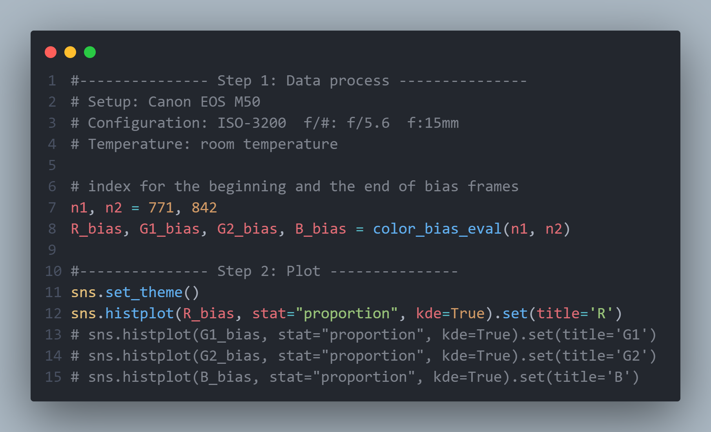


### c)行噪声$N_{r}$

原论文说是直接对bias frames进行离散傅里叶变换，这里我对曝光时间最小（Expo = 1/4000s）的bias frame进行DFT，用的np.fft，同时对明显的行噪声和列噪声（来源：网上找的例子）进行对比

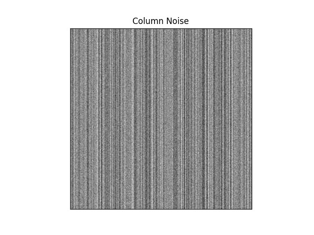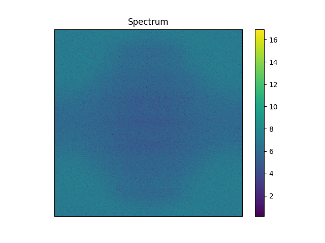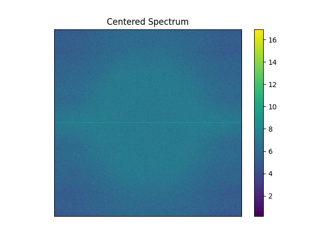

> np.fft.fftshift的作用：通过将零频分量移动到数组中心，重新排列傅里叶变换的结果
>
> 我们知道：经过FFT之后，输出的频率范围是[0,fs]，但是，我们研究的范围一般是[-fs/2, fs/2]，也就是零频在中间，因此就需要将FFT的结果通过fftshift处理一下，将零频分量移到序列中间。

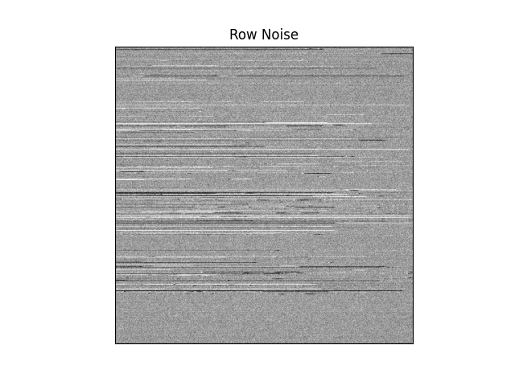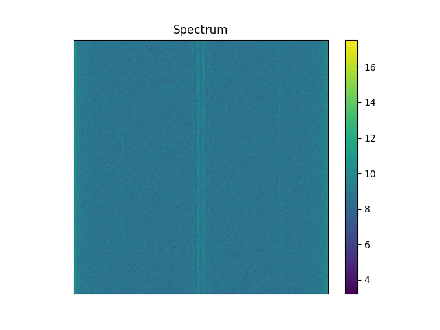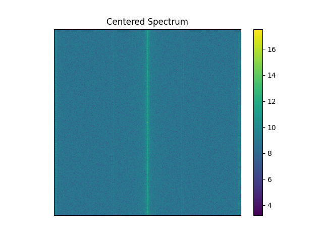

Bias frame(1/4000s):

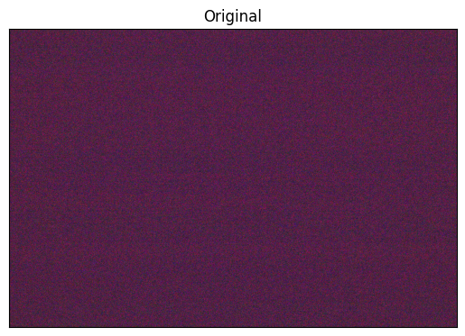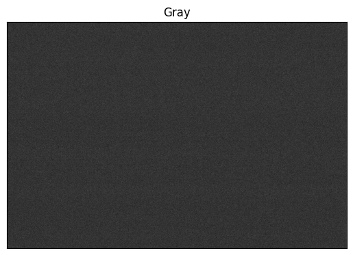

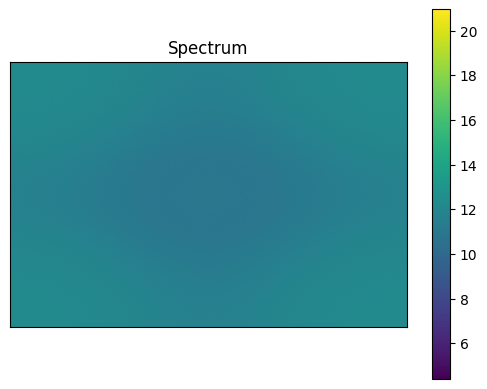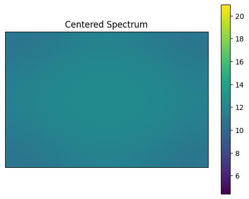

这么一对比，Canon M50拍出来的bias frames行噪声就不是很明显。


**具体实现代码：**

在文件row_noise.py中，实现代码片段如下：

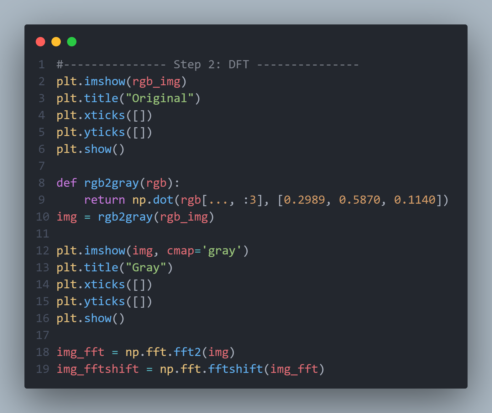

> 在接下去之前，论文第六页在**Estimate $\mu_c$​ for color bias** 结尾处提到为了消除直流噪声对后续其他噪声参数估计的影响，先从暗场图像中减去每个颜色通道的平均值，这里我每个通道减去的值都取为2048

行噪声服从均值为零的高斯分布：$N_r \sim \mathcal{N}(o, \sigma_r)$ 

关于参数$\sigma_r$ 是如何估计的：首先求出暗场图像每行的均值（这里论文的意思好像不需要减去黑电平也能求出$\sigma_r$），然后相应地就可以得到每一行的方差，最后行噪声就是由这么一组按行排列的高斯分布采样得到的信号值。关于这部分的实现原理去read_noise.py看代码实现会更清楚直观一些。

```python
######### Row noise parameters #########
# extract mean values from each row
mu_row = np.sum(raw_data, axis=1) / w
mu_row2d = mu_row.reshape(h, 1)
mu_row_t = np.tile(mu_row2d, w)

# maximizing the log-likelihood
sigma2 = np.sum((raw_data - mu_row_t)**2, axis=1) / w

######################## Step 2: row noise image ######################
raw_row = np.zeros((h, w), dtype=np.float64)
for i in range(h):
    raw_row[i][:] = np.random.normal(loc=mu_row[i], scale=np.sqrt(sigma2[i]), size=w)
```


### c) 读噪声$N_{read}$

> 补充下关于Probability Plot的知识：
>
> The probability plot is a way of visually comparing the data coming from different distributions. These data can be of empirical dataset or theoretical dataset. The probability plot can be of two types:
>
> - **P-P plot:** The (Probability-to-Probability) p-p plot is the way to visualize the comparing of cumulative distribution function (CDFs) of the two distributions (empirical and theoretical) against each other.
> - **Q-Q plot:** The q-q (Quantile-to-Quantile) plot is used to compare the quantiles of two distributions. The quantiles can be defined as continuous intervals with equal probabilities or dividing the samples between a similar way The distributions may be theoretical or sample distributions from a process, etc. The normal probability plot is a case of the q-q plot.
>
> **Normal Probability plot:** The normal probability plot is a way of knowing whether the dataset is normally distributed or not. In this plot, data is plotted against the theoretical normal distribution plot in a way such that if a given dataset is normally distributed it should form an approximate straight line. The normal probability plot is a case of the probability plot (more specifically Q-Q plot). This plot is commonly used in the industry for finding the deviation from the normal process. 
>
> *Source: https://www.geeksforgeeks.org/normal-probability-plot/*


**1. Gaussian Probability Plot**

**Preprocess:**

用暗场图像先减去上一步的行噪声，然后为了加速运算，我在代码中取图像正中间一小块部分来运算（不求速度的话可以用整张图的数据去算分布），然后就可以画Q-Q图了。


结果发现和正态分布拟合地很好，接下来看看和Tukey lambda分布拟合情况如何。


**2. Tukey Lambda PPCC Plot**

> 补充知识：
>
> *Reference: *
>
> *1.https://www.itl.nist.gov/div898/software/dataplot/refman1/auxillar/ppccplot.htm*
>
> *2.https://moonapi.com/news/4061.html*
>
> *3.https://www.itl.nist.gov/div898/handbook/eda/section3/eda366f.htm*

> The [Tukey Lambda](https://www.itl.nist.gov/div898/handbook/eda/section3/eda366f.htm) PPCC plot, with shape parameter *λ*, is particularly useful for symmetric distributions. It indicates whether a distribution is short or long tailed and it can further indicate several common distributions. Specifically:
>
> 1. *λ* = -1: distribution is approximately Cauchy
> 2. *λ* = 0: distribution is exactly logistic
> 3. *λ* = 0.14: distribution is approximately normal
> 4. *λ* = 0.5: distribution is U-shaped
> 5. *λ* = 1: distribution is exactly uniform
>
> If the Tukey Lambda PPCC plot gives a maximum value near 0.14, we can reasonably conclude that the normal distribution is a good model for the data. If the maximum value is less than 0.14, a long-tailed distribution such as the double exponential or logistic would be a better choice. If the maximum value is near -1, this implies the selection of very long-tailed distribution, such as the Cauchy. If the maximum value is greater than 0.14, this implies a short-tailed distribution such as the Beta or uniform.
>
> *Source: https://www.itl.nist.gov/div898/software/dataplot/refman1/auxillar/ppccplot.htm*

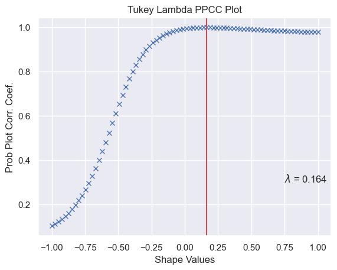

PPCC图可以用来求分布最符合的形状参数$\lambda$ ，结果如上：$\lambda = 0.164$ 表明了在Canon M50拍下的暗场图像呈短尾分布（$-1 <\lambda < 0.14$为长尾分布；$\lambda=0.14$呈完美的正态分布；$\lambda>0.14$​ 呈短尾分布）

> 注意在用Tukey lambda分布估计数据分布时要事先画直方图看数据是否对称分布
>
> As the Tukey-Lambda distribution is a symmetric distribution, the use of the Tukey-Lambda PPCC plot to determine a reasonable distribution to model the data only applies to symmetric distributions. A [histogram](https://www.itl.nist.gov/div898/handbook/eda/section3/histogra.htm) **of the data should provide evidence as to whether the data can be reasonably modeled with a symmetric distribution.**


**3. Tukey Lambda Probability Plot**

由于在PPCC图中我们得到了关于暗场图像的分布形状参数，也就是shape_param_max，即shape_param_max = $\lambda = 0.164$ ，所以也就得到了形状参数为0.164的Tukey lambda分布来估计暗场图像的分布，标定完后续就可以用这个分布来建立数据集。

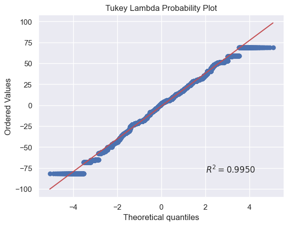

用形状参数$\lambda = 0.164$ 的分布来拟合发现和正态分布的Probability Plot拟合程度$R^2$区别不大，所以读出噪声可以近似为正态分布；关于Tukey Lambda分布的拟合情况请看下图（这里Tukey Lambda分布的参数$\lambda$ 我取的是-0.14，即原论文中佳能EOS70D的参数来进行对比）：

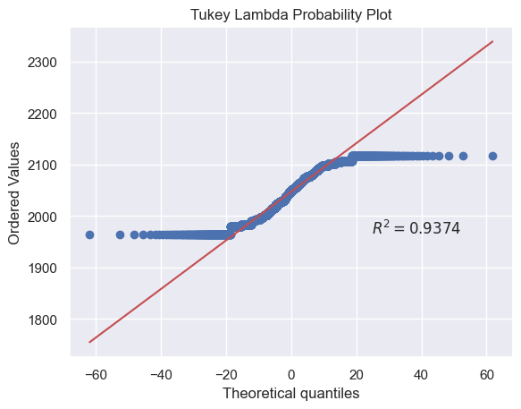

可以发现佳能M50的读出噪声对Tukey Lambda的分布拟合情况并不好，不如正态分布；不过发现在噪声极少的情况下（曝光时间30s，ISO为200），读出噪声更符合Tukey Lambda的分布，原因可能是当噪声变多后分布符合大数定律的原则。

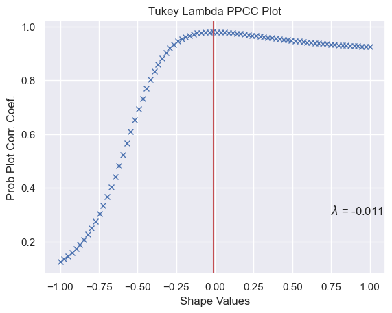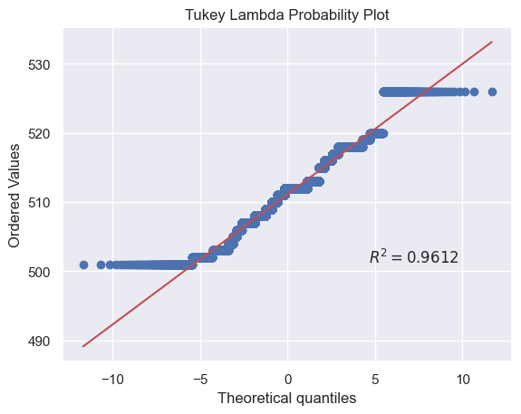

**具体实现代码：**

在文件read_noise.py中，实现代码片段如下：

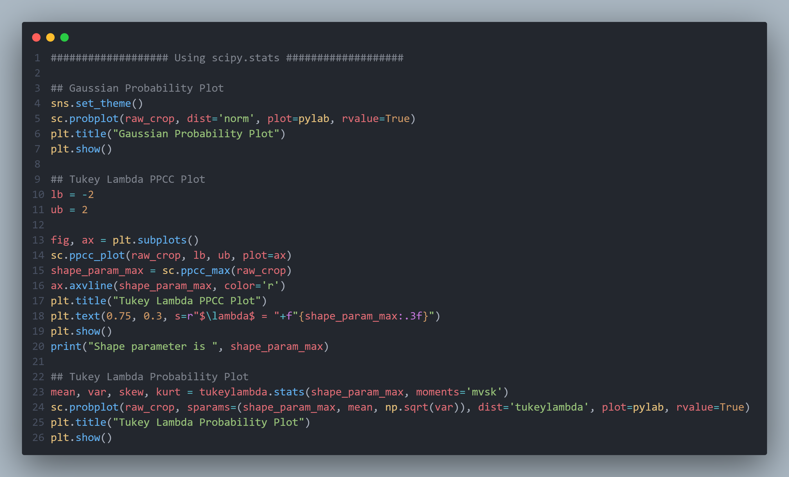


### d)重建流程

这一步是为了模拟仿真出真实相机传感器中产生的各种噪声，也就是利用公式（10）复原上述所讲的各种噪声，然后进行ISP流程如：线性化-->白平衡-->去马赛克-->颜色矫正-->亮度拉伸/Gamma矫正，最后重建出一张噪声图。

首先通过直方图直观地看重建的噪声图和原暗场图像之间的差异：


图形差异挺大的，原因可能是在原暗场图像中存在不少离群点，那我们用数据差异来看二者之间差异多大；这里用的指标是$R^2$ 和KL散度，其中$R^2$ 作了一些处理（由于噪声是随机出现在图像不同像素点位置的，所以为了避免位置对数值上差异的干扰，代码中对两幅图像素值作了排序，这样算$R^2$ 才不会出现负值），结果如下：

**R2 for estimated model: 0.9972249549587314** 

**KL-divergence: 0.0001303227610267369**

可以看出最后重建的效果不错，噪声图比较接近真实的暗场图像。

> 关于为何在代码中为何不加入光子散粒噪声：
>
> 因为这里重建的是暗场图像，不受实际光子影响，所以没加。如果想在一幅真实环境下图像加噪声，此时就可以考虑光子散粒噪声$N_p$的影响了

最后重建出来的效果如下（色调有点偏白，不过不是重建中出现的问题）：

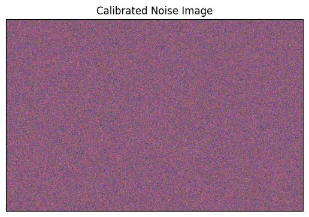


**具体实现代码：**在文件noise_img.py中可以直观地看每一步实现的细节

